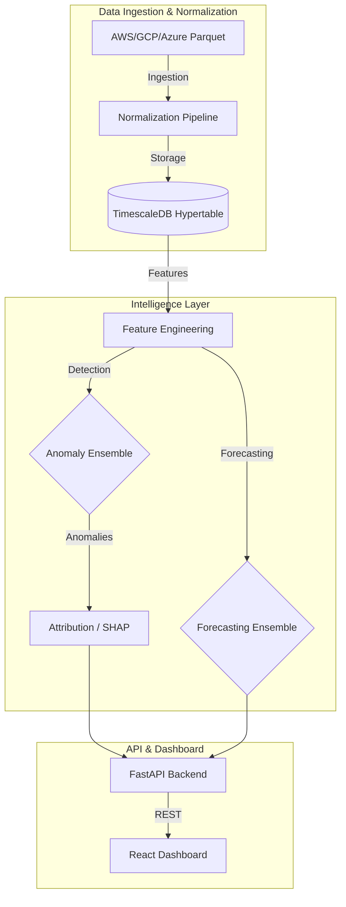

# 🌩️ Cloud FinOps Intelligence Platform

[](https://cloud-finops.vercel.app/)
[](https://finops-api-3g5p.onrender.com)
[](https://www.timescale.com/)

A production-grade, AI-driven observability and optimization platform for multi-cloud spend. This platform bridges the gap between raw billing data and strategic financial decisions using advanced ensemble ML models and high-performance temporal indexing.

---

## 🔗 Live Demo
*   **🔗 Dashboard**: [https://cloud-finops.vercel.app/](https://cloud-finops.vercel.app/)
*   **🔗 API**: [https://finops-api-3g5p.onrender.com](https://finops-api-3g5p.onrender.com)

---

## ✨ Features

- **🚀 Hybrid Forecasting Ensemble**: Combines **Facebook Prophet** (for seasonality and holidays) with **LightGBM** (for non-linear trend captures) to deliver ultra-precise 90-day spend projections.
- **🛡️ 3-Tier Anomaly Detection**: An ensemble scorer integrating:
    - **Statistical**: Z-Score detectors for immediate spikes.
    - **Machine Learning**: Isolation Forests for structural aberrations.
    - **Deep Learning**: LSTM Autoencoders for complex sequential patterns.
- **⚡ Temporal Indexing**: Utilizes **TimescaleDB hypertables** for high-efficiency querying of multi-million record datasets with minimal latency.
- **🧠 SHAP Attribution**: Automated explainability for cost anomalies, identifying exactly which service or region triggered a budget risk.
- **📈 Budget Risk Analysis**: Real-time projection of monthly burn rates against user-defined budgets with breach date prediction.

---

## 🏗️ Architecture



---

## 🛠️ Technology Stack

-   **Backend**: Python, FastAPI, Pydantic, SQLAlchemy.
-   **Machine Learning**: Scikit-learn, LightGBM, Prophet, PyTorch (LSTM).
-   **Database**: TimescaleDB (PostgreSQL) + temporal hypertables.
-   **Frontend**: React, Vite, Tailwind CSS, Recharts.
-   **Infrastructure**: Render (API/DB), Vercel (Frontend).

---

## 📂 Project Structure

| Module | Description |
| :--- | :--- |
| **`synthetic_data/`** | Highly realistic labeled billing data generator. |
| **`ingestion/`** | Connectors for AWS, GCP, and Azure billing exports. |
| **`normalization/`** | Canonical schema enforcement for multi-cloud parity. |
| **`storage/`** | Database manager and singleton connection pool logic. |
| **`detection/`** | Multi-algorithm anomaly detection engine. |
| **`forecasting/`** | Prophet + LightGBM ensemble forecasting models. |
| **`api/`** | RESTful interface serving intelligence to the frontend. |
| **`frontend/`** | High-fidelity React dashboard for cost visualization. |

---

## 🚀 Getting Started

### Prerequisites
- Python 3.9+
- Node.js 18+
- TimescaleDB (Postgres 14+)

### Local Setup
1. **Clone the repo**
   ```bash
   git clone https://github.com/Tejas028/FinOps.git
   cd FinOps
   ```
2. **Setup Backend**
   ```bash
   pip install -r requirements.txt
   uvicorn api.main:app --reload
   ```
3. **Setup Frontend**
   ```bash
   cd frontend
   npm install
   npm run dev
   ```

---

## 📸 Dashboard Preview


---

## 📜 License
This project is licensed under the MIT License - see the LICENSE file for details.

> [!NOTE]
> This project was built for the **FinOps Hackathon 2024**. "Hackathons aren't only about winning, they're about learning." — Me.
